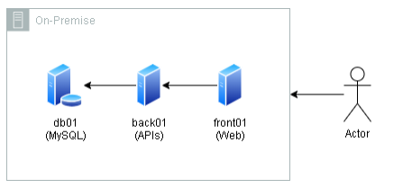
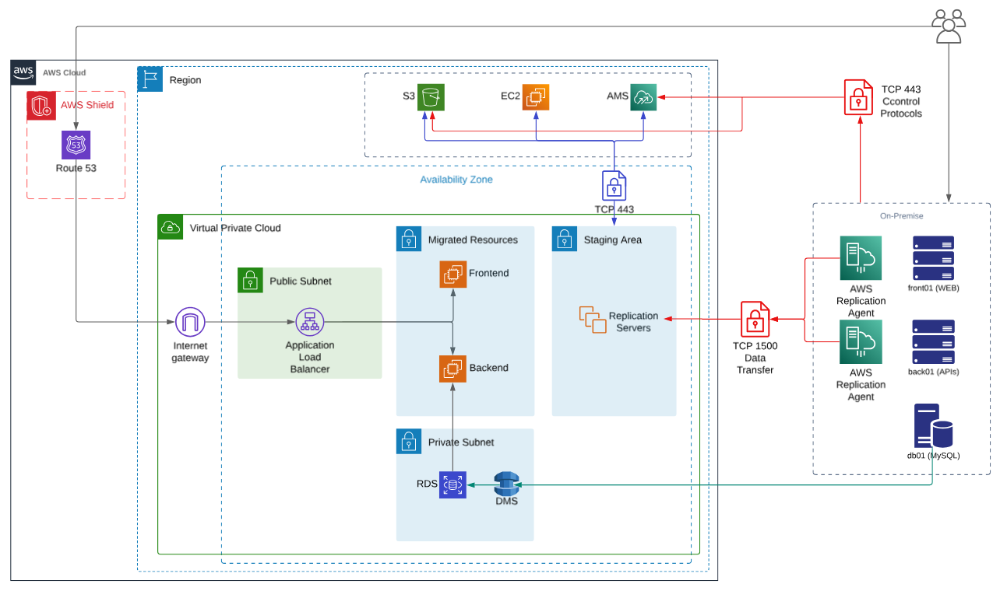
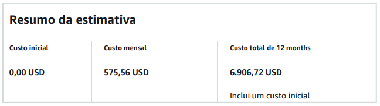
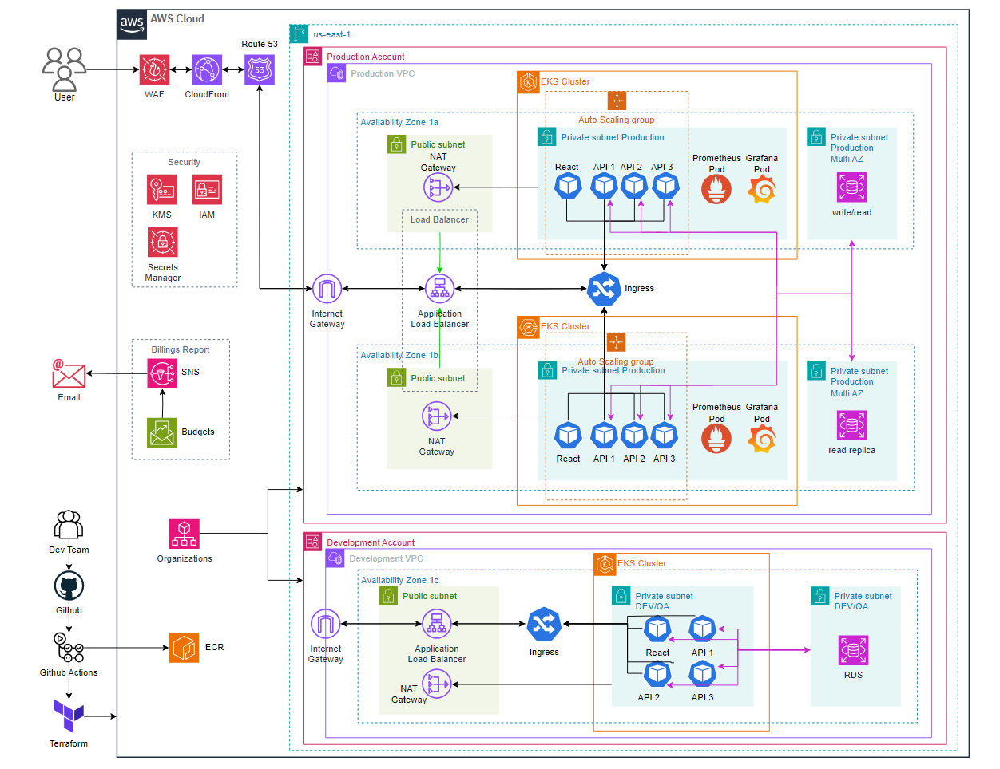
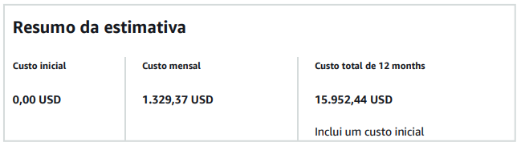
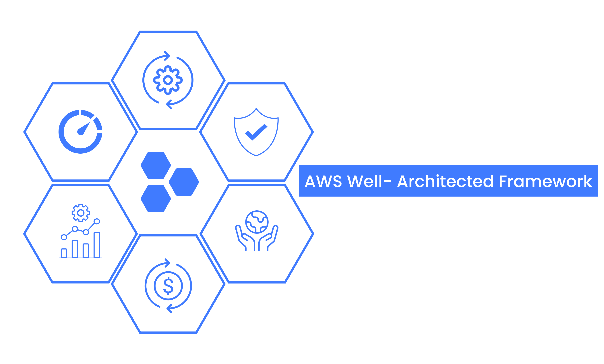

Este é um projeto com o intuito de simular para um cliente a migração de um sistema On-Premises para um sistema moderno na AWS. Sendo este um sistema escalável, resiliente e tolerante à falhas, utilizando Kubernetes.

## Contexto

Nós somos da empresa "Fast Engineering S/A" e gostaríamos de uma solução dos senhores(as), que fazem parte da empresa terceira "TI SOLUÇÕES INCRÍVEIS".

Nosso eCommerce está crescendo e a solução atual não está atendendo mais a alta demanda de acessos e compras que estamos tendo.

Atualmente usamos:

- 01 servidor para Banco de Dados Mysql (500GB de dados, 10Gb de RAM, 3 Core CPU);
- 01 servidor para a aplicação utilizando REACT – frontend (5GB de dados, 2Gb de RAM, 1 Core CPU);
- 01 servidor de backend com 3 APIs, com o Nginx servindo de balanceador de carga e que armazena estáticos como fotos e links. (5GB de dados, 4Gb de RAM, 2 Core CPU);

Queremos modernizar esse sistema para a AWS, precisamos seguir as melhores práticas arquitetura em Cloud AWS, a nova arquitetura deve seguir as seguintes diretrizes:

- Ambiente Kubernetes;
- Banco de dados gerenciado (PaaS e Multi AZ);
- Backup de dados;
- Sistema para persistência de objetos (imagens, vídeos etc.);
- Segurança;

Porém antes da migração acontecer para a nova estrutura, precisamos fazer uma migração “lift-and-shift” ou “as-is”, o mais rápido possível, só depois que iremos promover a modificação para a nova estrutura em Kubernetes.

## Etapa 1: As-Is

### Quais atividades são necessárias para a migração?

#### Application Migration Service

**1. On-Premises**

- Na infraestrutura local, os `agentes de replicação` são instalados nos servidores de backend e frontend. Os `agentes` irão estabelecer uma comunicação segura com o `AMS`, utilizando o procolo `TCP` na porta `443` para controle, e `TCP 1500` para transferência de dados.

**2. Staging Area**

- O `AMS` provisiona automaticamente uma `Stagin Area` dentro de uma `subnet privada`. Esta área contém `replication servers` que atuam como intemediários para receber os dados replicados. Os dados dos servidores `on-premises` são transmitidos incrementalmente para os `replication servers`.

**3. S3 para Armazenamento Temporário**

- Durante o processo de migração, os dados transferidos são armazenados temporariamente em `buckets S3`, otimizando o desempenho e garantido durabilidade.

**4. Testes de Migração**

- Após o término da replicação inicial, o `AMS` cria instâncias `EC2` de teste a partir dos dados replicados. Essas instâncias simulam os servidores de produção na nuvem. A equipe deve realizar validações para garantir que os servidores migrados operam como o esperado.

**5. Cutover**

- No momento do corte final (cutover), o `AMS` interrompe a replicação contínua. Os dados finais são transferidos, e as instâncias `EC2` de produção são iniciadas. As instâncias `EC2` substituem os servidores on-premises, e o tráfego é redirecionado para a `AWS`.

#### Database Migration Service

**1. Configuração do DMS**

- Para realizar a migração, cria-se uma intância de migração `DMS`, que fuinciona como o mecanismo principal para transferir os dados do banco de dados on-premises para o `RDS`. Esta instância deve estar em uma `subnet` privada, com acesso à origem (servidor db01 on-premises) e ao destino (RDS), através da criação de um endpoint para cada.

**2. Tarefa de Migração**

- A tarefa de migração será feita utilizando o modo `full load com replicação contínua`, que transfere os dados existentes e aplica alterações em tempo real. Para este contexto em que a migração precisa ser feita garantindo continuidade operacional, este foi o modo que mais se encaixa para esta necessidade.

**3. Migração Inicial**

- No modo `full load com replicação contínua`, o `DMS` copia os 500Gb do banco local para o `RDS`. Durante essa fase, o banco local pode continuar em operação, e as alterações posteriores serão repassadas para a fase de `replicação contínua`.

**4. Replicação Contínua**

- Após a carga inicial, o `DMS` monitora e aplica todas as alterações realizadas no banco local para o `RDS`, garantindo que os dados estejam sempre atualizados.

**5. Testes de Validação**

- Antes do `cutover`, a equipe realiza testes no banco `RDS` para verificar se os todos os dados foram transferidos com êxito e se está funcionando como o esperado.

**6. Cutover**

- No momento do corte, as conexões com o banco de dados on-premises são encerradas, e todas as aplicações são conectadas ao banco de dados `RDS`.

### Quais as ferramentas que vão ser utilizadas?

**AWS Shield**: O `AWS Shield` protege o ambiente contra ataques de `DDoS` (negação de serviço distribuída). No diagrama, é usado para proteger a aplicação exposta ao tráfego público, mitigando tentativas de sobrecarregar recursos, como o `Application Load Balancer`, garantindo disponibilidade e resiliência.

**Amazon Route 53**: O `Route 53` fornece resolução `DNS` (processo de transformar um nome de domínio em um endereço IP) para os domínios da aplicação. Ele direciona os usuários para o `Application Load Balancer`, garantindo que o tráfego seja roteado de forma eficiente e confiável.

**EC2 Frontend**: Instância `EC2` que possui a interface do usuário feita em `React`. Recebe requisições do balanceador de carga e se comunica com o `backend` para processar os dados.

**EC2 Backend**: Intância `EC2` que possui as regras de negócio do aplicativo com `3 APIs`, com o `Nginx` servindo de balanceador de carga e que armazena estáticos como fotos e links. Recebe as requisições do `frontend`, processa a lógica e interage com o banco de dados `RDS` para persistir ou recuperar informações.

**EC2 do AMS**: A `EC2` gerenciada pelo `AMS` é destinada à operações específicas relacionadas à etapa de migração dos servidores `on-premises` para a AWS. Sendo uma `EC2` do tipo `c5a.large`, que é utilizada para cargas computacionais intenças Com desempenho muito semelhante à `c5.large` porém mais barata por ser alimentada por processadores AMD EPYC.

**Amazon RDS for MySQL (RDS)**: O `RDS` é um serviço gerenciado que fornece um banco de dados relacional seguro e escalável. Ele elimina a necessidade de tarefas administrativas como backups e atualizações, garantindo alta disponibilidade e réplicas de leitura. Integrado ao `backend` na sub-rede privada, ele armazena e processa dados com desempenho e proteção otimizados.

**Amazon Virtual Private Cloud (VPC)**: A `VPC` isola logicamente a infraestrutura em uma rede privada, garantindo segurança e controle de tráfego. Dentro da `VPC`, existe uma subnet pública (para o Application Load Balancer) e subnets privadas (para servidores frontend, backend e bancos de dados), e um `NAT Gateway` para acesso à internet a partir das subnets privadas. Por padrão inclui um `Internet Gateway` que permite a `VPC` se comunique com a Internet.

**Application Load Balancer (ALB)**: O `ALB` distribui o tráfego recebido entre as instâncias `EC2` frontend e backend, garantindo alta disponibilidade e escalabilidade do aplicativo.

**Amazon Simple Storage Service (S3)**: O S3 será utilizado para armazenar arquivos temporários, para auxilixar o processo de migraçao do `AMS`

**Amazon Elastic Block Store (EBS)**: O `EBS` fornece armazenamento persistente para as instâncias `EC2`. Ele armazena dados críticos do sistema e arquivos necessários para as operações do `frontend` e `backend`, e serviços que dependem de instâncias `EC2`.

**AWS Database Migration Service (DMS)**: O `DMS` facilita a migração contínua de dados do banco de dados local para o `RDS` na AWS. Ele replica dados de maneira segura, permitindo migração em tempo real sem interrupção no serviço.

**AWS Application Migration Service (AMS)**: O `AMS` permite migração de servidores de aplicativos locais para instâncias `EC2` na AWS. Ele replica servidores físicos ou virtuais diretamente para a nuvem, garantindo consistência e mínima latência durante o processo.

**AWS IAM Access Analyser**: Esse serviço analisa políticas `IAM` e detecta permissões excessivamente amplas ou problemas de segurança. Ele ajuda a garantir que as permissões atribuídas aos recursos no `VPC` estejam de acordo com as práticas recomendadas.

**Amazon CloudWatch**: O `CloudWatch` monitora a saúde e o desempenho dos recursos no ambiente. Ele coleta métricas de instâncias `EC2`, `load balancer`, e outros serviços, permitindo alertas e ações baseadas em eventos.

### Qual o diagrama da infraestrutura na AWS?

### Como serão garantidos os requisitos de Segurança?

**1. Proteção contra ataques DDoS**

- `AWS Shield` é usado para mitigar ataques DDoS. O nível básico é integrado automaticamente para proteger recursos como o `Route 53`.

**2. Rede Segura**

- A `VPC` separa os recursos em sub-redes públicas e privadas.
- Apenas o `Application Load Balancer` está na sub-rede pública.
- Servidores frontend, backend e banco de dados estão isolados em sub-redes privadas sem acesso direto à Internet.

**3. Controle de Acesso**

- Security Groups: Controlam o tráfego de entrada e saída nas instâncias. Apenas o `ELB` pode acessar as instâncias `EC2`.
- Network ACLs: Adicionam uma camada adicional de segurança na sub-rede.

**4. Armazenamento Seguro**

- O `RDS` oferece criptografia em repouso e backups automáticos.

**5. Autenticação e Autorização**

- Integração com `IAM` para controle de acesso a recursos.
- Pode-se usar autenticação multi-fator (MFA) para acessar a `AWS Management Console`.

**6. Monitoramento e Logs**

- `AWS CloudWatch` monitora métricas, logs e eventos dos recursos da AWS.

### Como será realizado o processo de Backup?

- O processo de backup será realizado utilizando as funcionalidades nativas dos serviços `RDS` e `EBS`, com o suporte de serviços auxiliares como o `CloudWatch` para garantir a integridade dos dados. Cada serviço será configurado para realizar backups de acordo com as políticas de frequência e retenção estabelecidas.

- **RDS**: O backup do banco de dados será gerido através dos `backups automáticos` do `RDS`. Os backups serão configurados para garantir a retenção de dados de acordo com a frequência definida.
- **EBS**: O backup dos volumes EBS será realizado através da criação de `snapshots`. As criações de `snapshots` serão configuradas para executar periodicamente, de acordo com as políticas de retenção estabelecidas.
- **CloudWatch**: Será utilizado para configurar `alarmes` que monitorem a execução dos backups e garantam que os processos estão sendo realizados conforme o esperado.

### Qual o custo da infraestrutura na AWS (AWS Calculator)?

   <i>Para mais detalhes sobre a estimativa, <a href="https://github.com/Paulooo0/final-project-compass/blob/main/assets/as-is-precification.pdf">veja o PDF</a>
   Custos referentes apenas aos serviços de migração:
     S3 = 1,07 USD
     DMS = 139,98 USD
     EBS da instância do DMS = 17,25 USD
     AMS = 0,00 USD
     EC2 do AMS = 34,37 USD
     TOTAL = 192,67 USD
    </i>

## Etapa 2: Modernização/Kubernetes

### Quais atividades são necessárias para a migração?

1. Integração com CI/CD:

- Criação de pipelines de build, commit e deploy com Github Actions.

2. IaC:

- Provisionamento da infraestrutura de forma programática utilizando `Terraform`, garantidno consistência e escalabilidade da infraestrutura.

3. Criação e Configuração do Cluster Kubernetes:

- Depositar as imagens dos conteiners no `ECR`.
- Utilização do `EKS` para provisionamento e gerenciamento do cluster `Kubernetes`.
- Configuração dos ambientes de produção, desenvolvimento/testes, e serviços de monitoramento.

4. Outros recursos:

- Provisionamento dos recursos de apoio à aplicação, como o `RDS` para banco de dados, `Application Load Balancer` para distribuir a carga da aplicação, `Route 53` para DNS e gerenciar tráfego, e `CloudFront` para entrega de conteúdo.
- Utilização de serviços de segurança como `WAF` para proteger a aplicação web, `KMS` para gerenciar chaves, `Secrets Manager` para gerenciar credenciais, e `IAM` para gerenciar o acesso dos usuários da AWS.
- Utilizar `AWS Budgets` e `SNS` para enviar relatórios de faturamento para o cliente via e-mail.

### Quais as ferramentas que vão ser utilizadas?

- **WAF (Web Application Firewall)**: Protege as aplicações web bloqueando tráfego malicioso antes de atingir os servidores.

- **CloudFront**: Rede de entrega de conteúdo (CDN) que distribui dados, arquivos estáticos e APIs globalmente com baixa latência e alta transferência.

- **Route 53**: Serviço de `DNS` que roteia o tráfego para o `CloudFront` e outros serviços.

- **VPC (Virtual Private Cloud)**: Rede isolada logicamente onde todos os recursos da arquitetura estão hospedados.
  - **NAT Gateway**: Permite que os `pods` em `subnets` privadas acessem a internet para atualizações sem expô-los diretamente.
  - **Internet Gateway**: Conecta dos serviços da `VPC` com a internet.
  - **Subnets**: As `subnets` públicas subsidiam os `NAT Gateways` e o `Application Load Balancer`, as `subnets` privadas hospedam os pods do `EKS` e os bancos de dados `RDS`.
- **Application Load Balancer (ALB)**: Distribui o tráfego para o `Ingress`, que roteia o tráfego para os pods em execução no cluster `EKS`, garantindo alta disponibilidade e balanceamento entre as zonas de disponibilidade.

- **EKS (Elastic Kubernetes Service)**: Serviço que provisiona um cluster `Kubernetes` na nuvem AWS.

  - **Ingress**: Gerencia o roteamento de requisições HTTP/HTTPS entre o `ALB` e os pods que hospedam APIs, React e outros serviços.
  - **Produção**: Ambiente dedicado aos pods em execução que suportam os serviços para clientes finais.
  - **DEV/QA**: Ambiente isolado para desenvolvimento e testes, garantindo que as alterações sejam validadas antes de ir para produção.
  - **Monitoramento**: Pods dedicados ao `Prometheus` e Grafana para monitoramento de métricas, logs e observabilidade do cluster e aplicações.

- **RDS (Relational Database Service)**: Serviço de banco de dados gerenciado, rodando `MySQL` e em modo `Multi-AZ`.

  - **Produção**: Banco de dados principal que gerencia leituras e gravações das aplicações em produção. Em AZs diferentes, à réplicas de leitura otimizadas para aliviar a carga do banco principal em operações somente leitura. Se o banco principal cair, uma réplica de leitura automaticamente se tornará o novo banco principal.
  - **DEV/QA**: Banco de dados isolado para desenvolvimento e testes, evitando interferências no ambiente de produção.

- **GitHub**: Repositório onde o código-fonte do projeto é armazenado e versionado, permitindo colaboração entre os desenvolvedores.

- **Github Actions**: Automatiza pipelines de `CI/CD`, incluindo a execução de testes, build das imagens de contêiner e deploy no `EKS`.

- **Terraform**: Ferramenta de `IaC` (Infraestrutura como Código) usada para provisionar e gerenciar a infraestrutura AWS, garantindo consistência e automação.

- **ECR (Elastic Container Registry)**: Repositório gerenciado de imagens de contêiner que armazena as imagens usadas no cluster `EKS`.

- **KMS (Key Management Service)**: Gerencia as chaves de criptografia para proteger dados em trânsito e em repouso, incluindo os dados armazenados no `RDS`.

- **Secrets Manager**: Gerencia segredos como credenciais de banco de dados e chaves de API de forma segura e automatiza a rotação de segredos.

- **IAM (Identity and Access Management)**: Gerencia usuários, permissões e políticas de acesso aos recursos AWS, garantindo que cada componente tenha apenas os privilégios necessários.

- **Budgets**: Configura alertas financeiros para monitorar custos, uso e previsões de orçamento.

- **SNS (Simple Notification Service)**: Envia relatórios de faturamento e notificações de limites de custo por e-mail.

### Qual o diagrama da infraestrutura na AWS?

### Como serão garantidos os requisitos de Segurança?

### Como será realizado o processo de Backup?

### Qual o custo da infraestrutura na AWS (AWS Calculator)?

   <i>Para mais detalhes sobre a estimativa, <a href="https://github.com/Paulooo0/final-project-compass/blob/main/assets/modern-arch-precification.pdf">veja o PDF</a></i>

## Conclusão

&nbsp;&nbsp;&nbsp;&nbsp;Neste projeto foi proposta a migração de um sistema On-Premises para a nuvem AWS. Utilizando o princípio "as-is", também conhecido como "lift-and-shift", que se baseia em recriar o sistema local na nuvem, sem fazer alterações significativas, mantendo ao máximo o funcionamento original do sistema, possibilitando uma migração mais controlada.

&nbsp;&nbsp;&nbsp;&nbsp;Assim foi feito o planejamento de migração, ferramentas a serem utilizadas, e os custos presumidos tanto da migração quanto para manter a arquitetura na nuvem.

&nbsp;&nbsp;&nbsp;&nbsp;Após concluir a migração "as-is", o cliente necessita de um sistema moderno e escalável utilizando Kubernetes, e para isso, é necessário fazer alterações mais profundas no funcionamento do sistema.

&nbsp;&nbsp;&nbsp;&nbsp;O sistema original precisou ser divido em um sistema distribuído de microserviços para possibilitar uma escalabilidade muito maior. Foi necessária a diferenciação de ambientes, sendo divido entre produção e DEV/QA, sendo ambos idênticos mas com diferenças significativas no provisionamento de recursos computacionais. Utilização de banco de dados MultiAZ com Read Replica para garantir failover e maior escalabilidade. Inserção do ambiente de produção em auto-scaling groups para escalonamento horizontal com base na demanda, tanto para in-scale quanto para out-scale.

&nbsp;&nbsp;&nbsp;&nbsp;Também foram utilizados diversos serviços e ferramentas auxiliares para envio de relatórios de faturamento, políticas de acesso, segurança do sistema, resiliência e tolerância a falhas por parte da apicação.

&nbsp;&nbsp;&nbsp;&nbsp;A arquitetura do novo sistema garante excelência operacional, eficiência de performance, segurança, sustentabilidade e confiabilidade, que são todos os pilares do Well-Archtected Framework.

