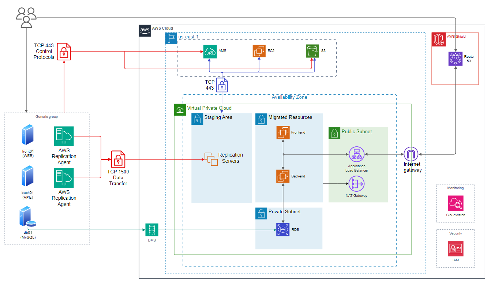
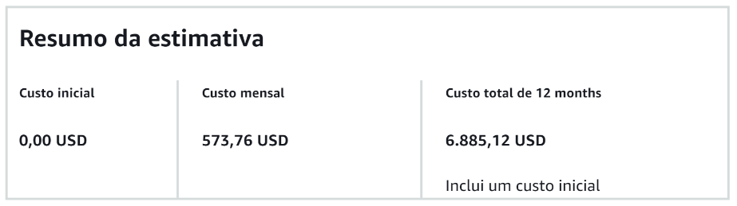

## Contexto

Nós somos da empresa "Fast Engineering S/A" e gostaríamos de uma solução dos senhores(as), que fazem parte da empresa terceira "TI SOLUÇÕES INCRÍVEIS".

Nosso eCommerce está crescendo e a solução atual não está atendendo mais a alta demanda de acessos e compras que estamos tendo.

Atualmente usamos:

- 01 servidor para Banco de Dados Mysql (500GB de dados, 10Gb de RAM, 3 Core CPU);
- 01 servidor para a aplicação utilizando REACT – frontend (5GB de dados, 2Gb de RAM, 1 Core CPU);
- 01 servidor de backend com 3 APIs, com o Nginx servindo de balanceador de carga e que armazena estáticos como fotos e links. (5GB de dados, 4Gb de RAM, 2 Core CPU);

Queremos modernizar esse sistema para a AWS, precisamos seguir as melhores práticas arquitetura em Cloud AWS, a nova arquitetura deve seguir as seguintes diretrizes:

- Ambiente Kubernetes;
- Banco de dados gerenciado (PaaS e Multi AZ);
- Backup de dados;
- Sistema para persistência de objetos (imagens, vídeos etc.);
- Segurança;

Porém antes da migração acontecer para a nova estrutura, precisamos fazer uma migração “lift-and-shift” ou “as-is”, o mais rápido possível, só depois que iremos promover a modificação para a nova estrutura em Kubernetes.

## Etapa 1: As-Is

### Quais atividades são necessárias para a migração?

#### Application Migration Service

**1. On-Premises**

- Na infraestrutura local, os `agentes de replicação` são instalados nos servidores de backend e frontend. Os `agentes` irão estabelecer uma comunicação segura com o `AMS`, utilizando o procolo `TCP` na porta `443` para controle, e `TCP 1500` para transferência de dados.

**2. Staging Area**

- O `AMS` provisiona automaticamente uma `Stagin Area` dentro de uma `subnet privada`. Esta área contém `replication servers` que atuam como intemediários para receber os dados replicados. Os dados dos servidores `on-premises` são transmitidos incrementalmente para os `replication servers`.

**3. S3 para Armazenamento Temporário**

- Durante o processo de migração, os dados transferidos são armazenados temporariamente em `buckets S3`, otimizando o desempenho e garantido durabilidade.

**4. Testes de Migração**

- Após o término da replicação inicial, o `AMS` cria instâncias `EC2` de teste a partir dos dados replicados. Essas instâncias simulam os servidores de produção na nuvem. A equipe deve realizar validações para garantir que os servidores migrados operam como o esperado.

**5. Cutover**

- No momento do corte final (cutover), o `AMS` interrompe a replicação contínua. Os dados finais são transferidos, e as instâncias `EC2` de produção são iniciadas. As instâncias `EC2` substituem os servidores on-premises, e o tráfego é redirecionado para a `AWS`.

#### Database Migration Service

**1. Configuração do DMS**

- Para realizar a migração, cria-se uma intância de migração `DMS`, que fuinciona como o mecanismo principal para transferir os dados do banco de dados on-premises para o `RDS`. Esta instância deve estar em uma `subnet` privada, com acesso à origem (servidor db01 on-premises) e ao destino (RDS), através da criação de um endpoint para cada.

**2. Tarefa de Migração**

- A tarefa de migração será feita utilizando o modo `full load com replicação contínua`, que transfere os dados existentes e aplica alterações em tempo real. Para este contexto em que a migração precisa ser feita garantindo continuidade operacional, este foi o modo que mais se encaixa para esta necessidade.

**3. Migração Inicial**

- No modo `full load com replicação contínua`, o `DMS` copia os 500Gb do banco local para o `RDS`. Durante essa fase, o banco local pode continuar em operação, e as alterações posteriores serão repassadas para a fase de `replicação contínua`.

**4. Replicação Contínua**

- Após a carga inicial, o `DMS` monitora e aplica todas as alterações realizadas no banco local para o `RDS`, garantindo que os dados estejam sempre atualizados.

**5. Testes de Validação**

- Antes do `cutover`, a equipe realiza testes no banco `RDS` para verificar se os todos os dados foram transferidos com êxito e se está funcionando como o esperado.

**6. Cutover**

- No momento do corte, as conexões com o banco de dados on-premises são encerradas, e todas as aplicações são conectadas ao banco de dados `RDS`.

### Quais as ferramentas vão ser utilizadas?

### Qual o diagrama da infraestrutura na AWS?

### Como serão garantidos os requisitos de Segurança?

**1. Proteção contra ataques DDoS**

- `AWS Shield` é usado para mitigar ataques DDoS. O nível básico é integrado automaticamente para proteger recursos como o `Route 53`.

**2. Rede Segura**

- A `VPC` separa os recursos em sub-redes públicas e privadas.
- Apenas o `Application Load Balancer` está na sub-rede pública.
- Servidores frontend, backend e banco de dados estão isolados em sub-redes privadas sem acesso direto à Internet.

**3. Controle de Acesso**

- Security Groups: Controlam o tráfego de entrada e saída nas instâncias. Apenas o `ELB` pode acessar as instâncias `EC2`.
- Network ACLs: Adicionam uma camada adicional de segurança na sub-rede.

**4. Armazenamento Seguro**

- O `RDS` oferece criptografia em repouso e backups automáticos.

**5. Autenticação e Autorização**

- Integração com `IAM` para controle de acesso a recursos.
- Pode-se usar autenticação multi-fator (MFA) para acessar a `AWS Management Console`.

**6. Monitoramento e Logs**

- `AWS CloudWatch` monitora métricas, logs e eventos.
- `AWS CloudTrail` rastreia atividades no ambiente AWS para auditoria de segurança.
- `SNS` envia notificações caso haja algum comportamento anômalo.

### Como será realizado o processo de Backup?

- O processo de backup será realizado utilizando as funcionalidades nativas dos serviços `RDS` e `EBS`, com o suporte de serviços auxiliares como o `CloudWatch` e `SNS` para garantir a integridade dos dados. Cada serviço será configurado para realizar backups de acordo com as políticas de frequência e retenção estabelecidas.

- **RDS**: O backup do banco de dados será gerido através dos `backups automáticos`. Serão configurados para garantir a retenção de dados de acordo com a frequência definida.
- **EBS**: O backup dos volumes EBS será realizado através da criação de `snapshots`. Serão configurados para executar periodicamente, de acordo com as políticas de retenção estabelecidas.
- **CloudWatch**: Será utilizado para configurar alarmes que monitorem a execução dos backups e garantam que os processos estão sendo realizados conforme o esperado. Caso algum backup falhe ou algum evento crítico ocorra, o `CloudWatch` acionará as notificações.
- **SNS**: Integrado ao `CloudWatch`, o `SNS` será configurado para enviar notificações em tempo real sobre o status dos backups.

### Qual o custo da infraestrutura na AWS (AWS Calculator)?

   <i>Para mais detalhes sobre a estimativa, <a href="https://github.com/Paulooo0/final-project-compass/blob/main/assets/My Estimate - Calculadora de Preços da AWS.pdf">veja o PDF</a></i>

## Etapa 2: Modernização/Kubernetes

### Quais atividades são necessárias para a migração?

### Quais as ferramentas vão ser utilizadas?

### Qual o diagrama da infraestrutura na AWS?

### Como serão garantidos os requisitos de Segurança?

### Como será realizado o processo de Backup?

### Qual o custo da infraestrutura na AWS (AWS Calculator)?

## Conclusão
